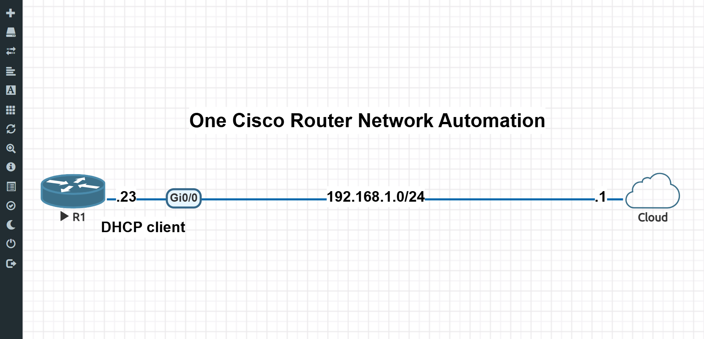
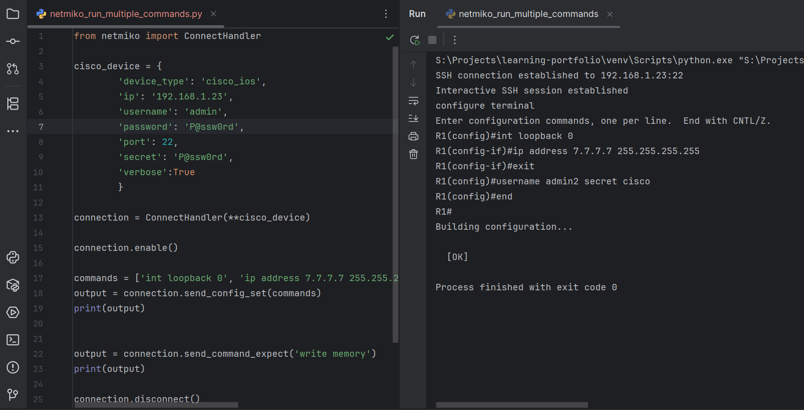
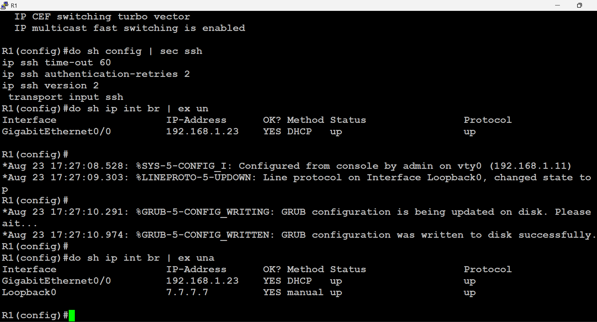

# One Cisco Router Network Automation Lab

## Objective
This lab demonstrates how to use Python and the `netmiko` library to automate configuration tasks on a Cisco IOS router. The script connects to the router via SSH, elevates to privileged EXEC mode, provisions a new Loopback interface, creates a new local user, and saves the configuration. 

## Topology
* **Environment:** EVE-NG
* **Device:** 1x Cisco IOS Router (R1)
* **Management Network:** The router is connected to a Cloud management network (`192.168.1.0/24`) via interface `Gi0/0`, which receives its IP address (`192.168.1.23`) via DHCP.

## Prerequisites
* Python 3.x installed (developed in VS Code)
* `netmiko` library installed (`pip install netmiko`)
* The Cisco router must be pre-configured for SSH access (RSA keys generated, VTY lines configured for SSH transport, and a local user created).

## Script Execution Details
The `netmiko_run_multiple_commands.py` script performs the following sequence:
1. Establishes an interactive SSH session to `192.168.1.23`.
2. Enters enable mode using the provided secret.
3. Sends a set of configuration commands:
   * Creates `Loopback 0` and assigns the IP `7.7.7.7/32`.
   * Creates a secondary local user `admin2` with secret `cisco`.
4. Executes `write memory` to save the configuration to NVRAM.
5. Gracefully disconnects the SSH session.

## Verification
You can verify the configuration on the router console. Syslog messages will show the configuration being updated from a VTY line, the Line protocol for Loopback0 changing to 'up', and the GRUB configuration being written to disk successfully. Running `show ip int brief` will confirm `Loopback0` is configured with `7.7.7.7`.
